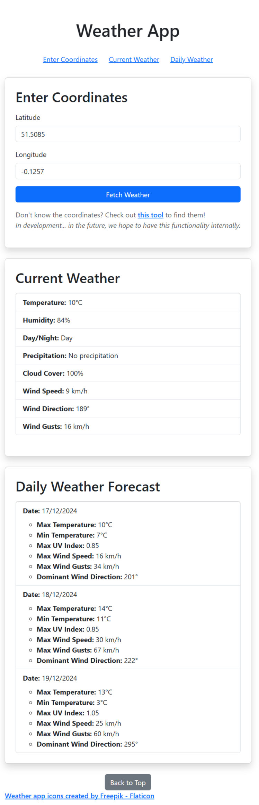

# Weather App 🌦️

A simple weather app built using React and Bootstrap. Allows users to fetch and display current weather and daily weather forecasts by entering latitude and longitude coordinates.

## Features
- Fetches weather data from an API
- Displays current and daily weather
- Responsive design using Bootstrap

## Installation
1. Clone the repository:
   ```bash
   git clone https://github.com/JoaoMLViegas/weather-app.git
2. Install dependencies:
   ```bash
   npm install
3. Run the app:
   ```bash
   npm run dev
## Preview
